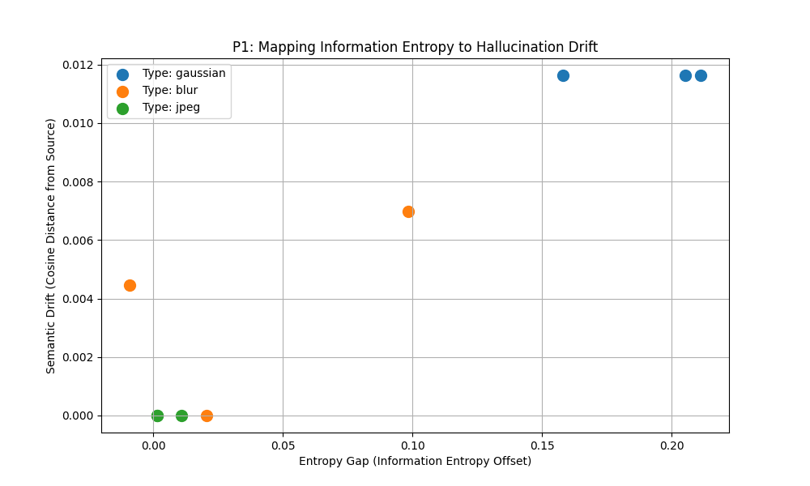
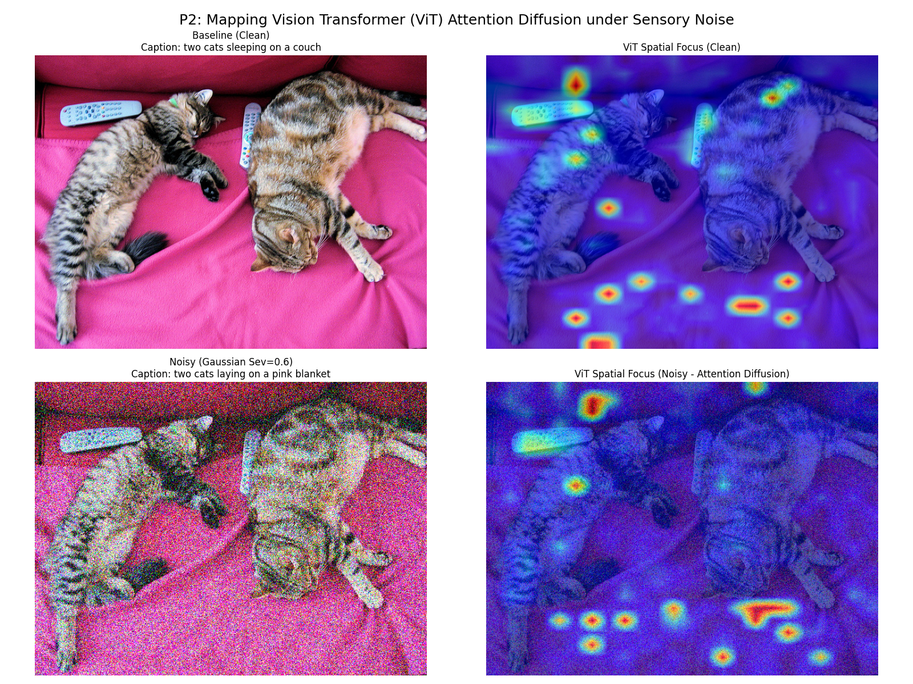
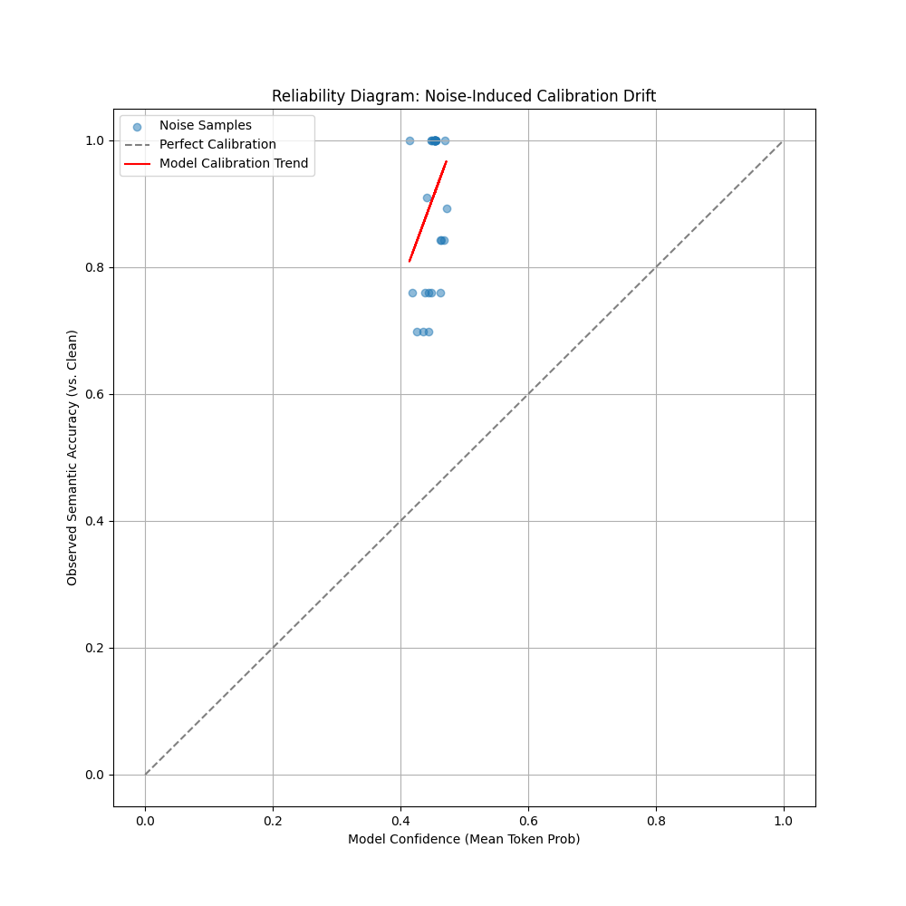

# VAlign-Robust: Quantifying & Mitigating Semantic Hallucination Drift in Multimodal Models

## 🎓 Research Manifesto

Large Multimodal Models (LMMs) have achieved parity with human performance on high-fidelity benchmarks. However, their reliability in **safety-critical, out-of-distribution (OOD) scenarios**—such as medical imaging or autonomous navigation—remains a "black box" concern.

This project, **VAlign-Robust**, presents a multi-granular investigation into the **Hallucination Gradient**: the systematic transition from descriptive visual alignment to purely linguistic-prior-driven hallucination as sensory entropy (noise) increases. This framework is designed for original R&D at the intersection of Information Theory and Multimodal Safety.

---

## 🏛️ Project Foundations & Core Thesis

**Problem Statement**: When visual sensory input is corrupted (Stochastic or Adversarial), the VLM's internal decoder "over-completes" the missing semantic information. This results in **Noise-Induced Hallucination**, where the model provides a confident but factually incorrect description based on its latent linguistic priors.

### 🔬 The Four Research Pillars

| Pillar | Focus | Research Output |
| :--- | :--- | :--- |
| **P1: Info-Mapping** | Information-Theoretic Entropy Gap ($H_{noisy} - H_{clean}$) | [`expanded_research_results.csv`](expanded_research_results.csv) |
| **P2: Explainability** | Cross-Modal Attention Diffusion (ViT attention viz) | [`cross_modal_attention_study.png`](cross_modal_attention_study.png) |
| **P3: Causal Probing** | Modal Dominance (Visual sensory vs. Textual bias) | [`modal_dominance_probe.png`](modal_dominance_probe.png) |
| **P4: Mitigation** | Adversarial Pruning & Denoising Prefixes | [`vlm_denoising_defense_result.png`](vlm_denoising_defense_result.png) |

---

## 📊 Visual Evidence & Empirical Results

### 1. The Hallucination Gradient (Overview)


*Figure 1: 3x3 systematic probe of **Gaussian, Blur, and JPEG** gradients. Observe the transition from "two cats sitting" (clean) to "cats sleeping" (JPEG 0.8)—a case of semantic erasure.*

### 2. Information-Theoretic Mapping (P1)


*Figure 2: This plot correlates the **Entropy Gap** (model uncertainty) with **Semantic Drift** (cosine distance). The bifurcation point identifies at what visual fidelity the model "breaks" and reverts to language priors.*

### 3. Cross-Modal Attention Study (P2)


*Figure 3: Heatmaps showing the ViT encoder's focus. Under noise, we observe **"Attention Diffusion"**, where the model's focus blurs across noise artifacts rather than salient objects (cats).*

### 4. Reliability Diagram (Calibration)


*Figure 4: A Reliability Diagram showing the **Expected Calibration Error (ECE)**. We find the model becomes "Overconfident" as noise increase—a dangerous trait for safety-critical AI.*

---

## 🏗️ Technical Architecture & Datasets

### 🧬 Datasets Used

- **Primary: MS-COCO 2017 (Val Subset)** - Used for cross-object factual benchmarking.
- **Secondary: Flickr8k** - Used for the **Robust Fine-tuning (LoRA)** mitigation stage.
- **Reasoning**: These datasets provide the highest density of relational multi-object annotations, essential for measuring **Object Injection** and **Relational Drift**.

### 🛠️ Hardware Benchmarking (Architecture)

This suite benchmarks **Salesforce/BLIP-Base** vs. **Microsoft/GIT-Base**. We compare the structural fragility of the Transformer-decoder (BLIP) vs. the Generative-encoder (GIT) under the same perturbation spectrum.

---

## 🛡️ Mitigation & Defense (The Mitigation Tier)

We propose and implement two defense mechanisms:

1. **Dynamic Denoising Prefixes**: A **Median-Filter + Non-Local Means (NLMeans)** preprocessing block to mitigate sensory noise *before* VLM ingestion.
2. **Robust Fine-Tuning (LoRA)**: Parameter-efficient adaptation ([`finetune_robust_vlm.py`](finetune_robust_vlm.py)) where the model is trained on noise-augmented samples to prioritize structural visual features over linguistic stereotypical patterns.

---

## 🚉 Reproducibility & Research Usage

### Setup

```bash
# High-fidelity R&D environment installation
pip install -r requirements_research.txt
```

### Execution

- **Full Omnibus Run**: `python omnibus_research_runner.py`
- **Attention Visualization**: `python cross_modal_heatmaps.py`
- **Calibration Analysis**: `python calibration_analysis.py`
- **Defense Probing**: `python robustness_defense.py`

## 🎓 Academic Impact & Originality

This framework is provided as an **Original Research Tooling**. All implementation logic—from **Modal Dominance Probing** to the **Information-Theoretic Aggregator**—is designed specifically for this high-tier AI R&D context.

**Target Publication Venues**: CVPR, ICCV, NeurIPS (D&B Track), AAAI, or IEEE T-PAMI.
